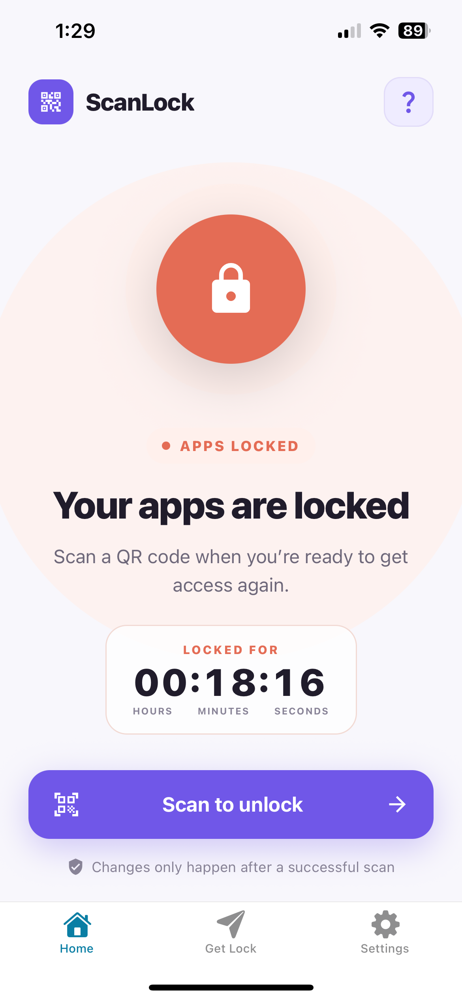
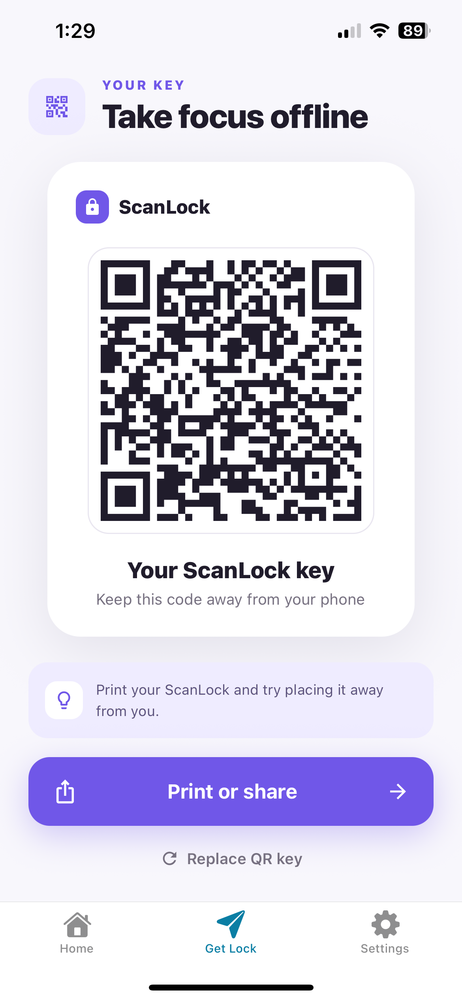
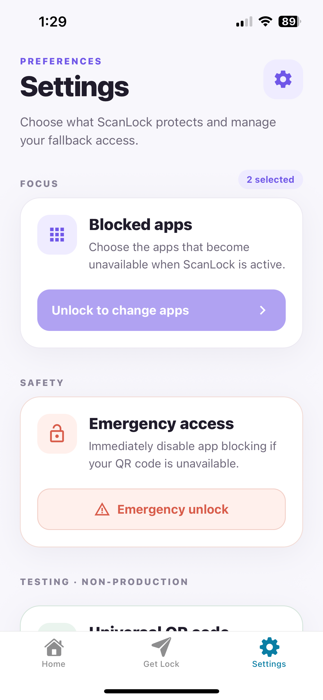
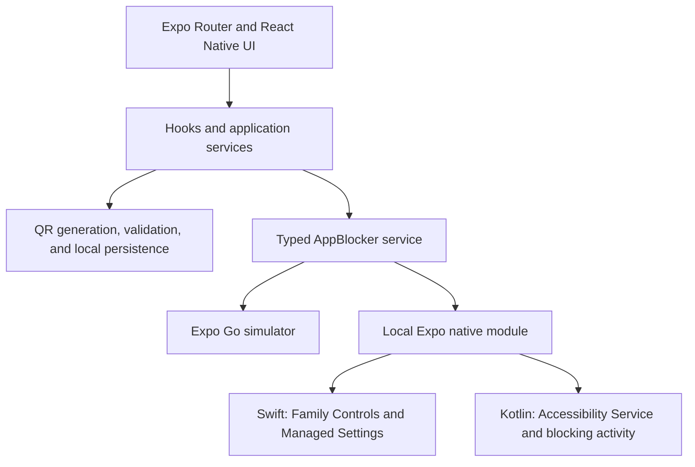

<p align="center">
  
</p>

<h1 align="center">ScanLock</h1>

<p align="center">
  Take focus offline by using a physical QR key to lock and unlock distracting apps.
</p>

> [!NOTE]
> ScanLock is experimental and under active development. The iOS implementation has received the most extensive automated and physical-device testing. Android is implemented and has been tested in an emulator, but still needs broader physical-device validation.

## About ScanLock

Are you losing time to doomscrolling? Unlock your time with ScanLock.

ScanLock is an Expo and React Native app that creates a printable QR key for locking and unlocking selected apps. Print or share the key, place it away from your phone, and create a physical barrier between yourself and the apps that waste your time. Regaining access requires intentionally walking to the QR key and scanning it.

The goal is not to make distracting apps permanently inaccessible. It is to add enough real-world friction to interrupt an automatic habit while keeping an emergency recovery option available.

## How it works

1. Grant the platform's required authorization and choose the apps you want ScanLock to protect.
2. ScanLock generates a random local identifier and encodes it in a printable QR key.
3. Print or share the key and place it somewhere away from your phone.
4. Scan the matching QR key to lock the selected apps.
5. Scan the same key again when you intentionally want to unlock them.

Invalid, malformed, replaced, or unrelated QR codes do not change the lock state. The QR key can be rotated while the app is unlocked, and an explicit emergency-unlock flow is available if the physical key cannot be reached.

## Screenshots

<table>
  <tr>
    <td align="center"><strong>Lock status</strong></td>
    <td align="center"><strong>Printable QR key</strong></td>
    <td align="center"><strong>App selection and recovery</strong></td>
  </tr>
  <tr>
    <td></td>
    <td></td>
    <td></td>
  </tr>
</table>

## Platform support

| Platform | Blocking mechanism | Current validation |
| --- | --- | --- |
| iOS | Family Controls app picker and Managed Settings shields | Jest, XCTest, and physical-device testing |
| Android | Accessibility Service, native app picker, and blocking activity | Kotlin unit tests and emulator testing; physical-device testing remains |
| Expo Go | In-memory simulated blocker | Intended for UI and JavaScript development only |
| Web | UI development only | Native app blocking is unavailable |

Real app blocking cannot be tested in Expo Go. Use a native development, preview, or production build to validate authorization, app selection, blocking, persistence, and recovery.

## Getting started

### Requirements

- Node.js 22.13 or newer
- npm
If building android locally:
- Android Studio and the Android SDK for local Android native builds
If building ios locally:
- macOS and Xcode for local iOS native builds
- (For ios) An Apple Developer account, Family Controls entitlement access, and a physical iPhone or iPad for complete iOS validation
If building with Expo EAS cloud
- An Expo account for EAS cloud builds (you will still need an Apple Developer account to build ios)


### Install

Clone the repository and install the JavaScript dependencies from the application directory:

```sh
git clone https://github.com/Cytadell/ScanLock.git
cd ScanLock/scanlock
npm install
```

### Start the development server

```sh
npm start
```

This starts Expo's development server. Expo Go can be used to inspect most of the interface with the simulated app-blocker service, but it cannot load ScanLock's custom Swift or Kotlin modules. Instead these native features are simulated for testing purposes.

### Run a native development build

Android:

```sh
npm run android
```

This generates the native Android project when necessary, compiles it with Gradle, installs it on a connected device or emulator, and starts Metro.

iOS, on macOS only:

```sh
npm run ios
```

This generates the native iOS project when necessary, compiles it with Xcode, installs it on a simulator or device, and starts Metro. Family Controls behavior must ultimately be tested on a physical Apple device.

The browser target is useful for UI work but does not provide native app blocking:

```sh
npm run web
```

On Windows systems that block PowerShell command shims, use `npm.cmd` and `npx.cmd` in place of `npm` and `npx`.

## Architecture

ScanLock keeps the React Native interface independent from the platform-specific blocking implementation by placing a typed service in front of a local Expo native module.



### iOS consistency and recovery

The iOS implementation treats a lock-state change as a transaction rather than assuming the platform operation succeeded. Its state machine records an operation journal, applies or removes shields, verifies the resulting state, rolls back failed changes, and recovers interrupted operations after relaunch. This prevents the React Native interface from reporting a successful lock or unlock before the native state is confirmed.

### Continuous Native Generation

The generated `ios/` and `android/` directories are not committed. Expo Prebuild recreates them from `app.json`, installed packages, the local `modules/app-blocker` module, and config plugins. The `with-ios-unit-tests` plugin also recreates the XCTest target and shared scheme during Prebuild.

## Technology

- Expo SDK 54, React Native 0.81, and React 19
- Expo Router and TypeScript
- Swift, Family Controls, Managed Settings, and XCTest on iOS
- Kotlin, Android Accessibility APIs, native activities, and JUnit on Android
- AsyncStorage and Expo Crypto for QR-key persistence and generation
- Jest and React Native Testing Library for application tests
- EAS Build and EAS Workflows for cloud testing and native builds

The minimum configured iOS deployment target is 16.0, and tablet support is enabled.

## Testing and verification

Run the local JavaScript and TypeScript checks before opening a pull request:

```sh
npx tsc --noEmit
npm run lint
npm test
```

The current Jest suite contains 50 tests across application services, hooks, persistence, QR validation, native-service interactions, and user-visible lock-state behavior. Generate a local coverage report with:

```sh
npm run test:coverage
```

The HTML report is written to `coverage/lcov-report/index.html`. Coverage output is intentionally ignored by Git.

### iOS native tests

On macOS, generate the native project and run the Swift unit tests with:

```sh
npx expo prebuild --clean --platform ios --no-install
cd ios && pod install && cd ..
npm run test:ios
```

The committed XCTest sources live in `native-tests/ios/`, outside the generated project. They verify selection persistence, the blocking journal, transaction rollback, failure handling, and interrupted-operation recovery. They do not prove that shields are visibly active, so final validation still requires the [native iOS manual-test checklist](../NATIVE_IOS_MANUAL_TESTS.txt) on physical devices.

Android native behavior has a JUnit decision test and a separate [Android manual-test checklist](../NATIVE_ANDROID_MANUAL_TESTS.txt) covering authorization, selection, enforcement, persistence, reboot behavior, and recovery.

## EAS builds

Build profiles are defined in `eas.json`:

- `development`: internal development-client build
- `preview`: internal build with the universal debug QR enabled
- `production`: store-oriented build with the universal debug QR disabled

iOS builds:

```sh
npx eas-cli@latest build --platform ios --profile development
npx eas-cli@latest build --platform ios --profile preview
npx eas-cli@latest build --platform ios --profile production
```

Android builds:

```sh
npx eas-cli@latest build --platform android --profile development
npx eas-cli@latest build --platform android --profile preview
npx eas-cli@latest build --platform android --profile production
```

The manually triggered gated iOS workflow runs Jest on Linux, runs XCTest on an EAS macOS simulator, and creates a preview build only after both test jobs pass:

```sh
npx eas-cli@latest workflow:run .eas/workflows/test-and-build.yml
```

Pushes to `main` do not automatically consume an EAS build. The workflow runs only when explicitly requested.

## Codebase guide

- `app/` — Expo Router screens and layouts
- `modules/app-blocker/` — Swift and Kotlin native blocking implementations
- `services/` — QR logic, persistence, and the native-module boundary
- `native-tests/ios/` — XCTest coverage for native state and recovery
- `tests/` — Jest and React Native Testing Library suites
- `plugins/` — Expo Prebuild configuration, including XCTest target generation

## Current limitations and release status

- Android still requires validation on multiple physical devices and manufacturers.
- App Store distribution requires approval for the Family Controls distribution entitlement.
- Production privacy metadata, support/privacy URLs, and final release smoke testing remain outstanding.


See the repository-level `TODO` file and native manual-test checklists for the remaining release work.

## License

ScanLock is available under the [Mozilla Public License 2.0](LICENSE).
Modifications to covered source files must remain available under the MPL 2.0
when distributed.
